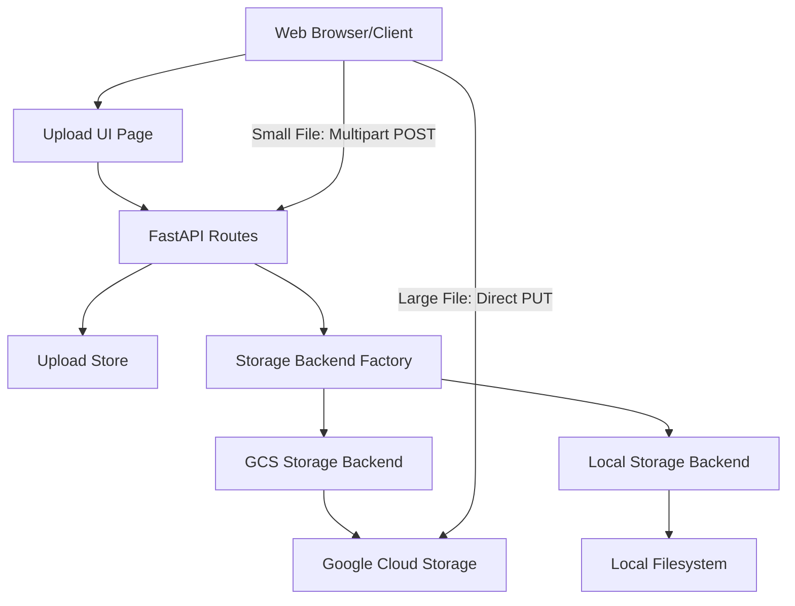

# Design Document

## Overview

The File Upload Module extends the EduScale Engine with a dual-mode file upload system that supports both Google Cloud Storage (GCS) for production deployments and local filesystem storage for development. The design follows a modular architecture with clear separation between HTTP handling, storage backends, and session management.

The system implements a **dual-path upload strategy** based on file size to work around Cloud Run's 32 MB request body limit:

**Path 1: Direct Upload (≤31 MB)**
- Client sends file and metadata in a single multipart/form-data request
- Server validates, streams to storage, and returns result
- Simple, synchronous flow for small files

**Path 2: Signed URL Upload (>31 MB)**
- Client creates upload session with metadata only (POST /api/v1/upload/sessions)
- Server generates GCS V4 signed URL with 15-minute expiration
- Client uploads file directly to GCS using signed URL (bypassing Cloud Run)
- Client finalizes upload by calling completion endpoint (POST /api/v1/upload/complete)
- Eliminates proxy overhead and Cloud Run size limitations

This design optimizes for simplicity with small files while enabling efficient large file uploads without infrastructure constraints.

## Architecture

### High-Level Component Diagram



### Request Flows

**Flow 1: Direct Upload for Small Files (≤31 MB)**

1. Client calls `POST /api/v1/upload` with multipart/form-data containing file and region_id
2. API validates request (size, MIME type, region_id)
3. API generates unique file_id (UUID4)
4. API routes file to appropriate storage backend:
   - **GCS Mode**: API streams file to Google Cloud Storage
   - **Local Mode**: API streams file to local filesystem
5. API records upload metadata in Upload Store
6. API returns success response with file_id and storage information

**Flow 2: Signed URL Upload for Large Files (>31 MB, GCS only)**

1. Client calls `POST /api/v1/upload/sessions` with JSON: {region_id, file_name, file_size_bytes, content_type}
2. API validates metadata (size, MIME type, region_id)
3. API generates unique file_id (UUID4)
4. API generates GCS V4 signed URL with:
   - 15-minute expiration
   - Content-Type constraint
   - Size constraint
5. API creates pending upload record in Upload Store
6. API returns {file_id, upload_method: "signed_url", signed_url, target_path, expires_at}
7. Client uploads file directly to GCS using PUT to signed_url
8. Client calls `POST /api/v1/upload/complete` with {file_id}
9. API verifies file exists in GCS
10. API updates upload record to completed status
11. API returns upload metadata

## Components and Interfaces

### 1. Configuration Extension (`eduscale.core.config`)

Extend the existing `Settings` class with upload-specific configuration:

```python
class Settings(BaseSettings):
    # ... existing fields ...
    
    # Storage Configuration
    STORAGE_BACKEND: str = "local"  # "gcs" or "local"
    GCS_BUCKET_NAME: str = ""
    
    # Upload Constraints
    MAX_UPLOAD_MB: int = 50
    ALLOWED_UPLOAD_MIME_TYPES: str = ""  # Comma-separated, empty = allow all
    DIRECT_UPLOAD_SIZE_THRESHOLD_MB: int = 31  # Files larger than this use signed URLs
    
    @property
    def allowed_mime_types(self) -> list[str] | None:
        """Parse ALLOWED_UPLOAD_MIME_TYPES into a list."""
        if not self.ALLOWED_UPLOAD_MIME_TYPES:
            return None
        return [mt.strip() for mt in self.ALLOWED_UPLOAD_MIME_TYPES.split(",")]
    
    @property
    def max_upload_bytes(self) -> int:
        """Convert MAX_UPLOAD_MB to bytes."""
        return self.MAX_UPLOAD_MB * 1024 * 1024
    
    @property
    def direct_upload_threshold_bytes(self) -> int:
        """Convert DIRECT_UPLOAD_SIZE_THRESHOLD_MB to bytes."""
        return self.DIRECT_UPLOAD_SIZE_THRESHOLD_MB * 1024 * 1024
```

### 2. Data Models (`eduscale.models.upload`)

Define Pydantic models for request/response validation:

```python
from pydantic import BaseModel
from datetime import datetime
from typing import Optional, Literal

class CreateSessionRequest(BaseModel):
    """Request model for creating upload session."""
    region_id: str
    file_name: str
    file_size_bytes: int
    content_type: str

class CreateSessionResponse(BaseModel):
    """Response model for upload session creation."""
    file_id: str
    upload_method: Literal["direct", "signed_url"]
    signed_url: Optional[str] = None
    target_path: str
    expires_at: Optional[datetime] = None

class CompleteUploadRequest(BaseModel):
    """Request model for completing signed URL upload."""
    file_id: str

class UploadResponse(BaseModel):
    """Response model for file upload."""
    file_id: str
    file_name: str
    storage_backend: str
    storage_path: str
    region_id: str
    content_type: str
    size_bytes: int
    created_at: datetime
```

### 3. Upload Store (`eduscale.storage.upload_store`)

In-memory upload tracking with status management for pending and completed uploads:

```python
from dataclasses import dataclass
from datetime import datetime
from typing import Dict, Optional
from enum import Enum

class UploadStatus(str, Enum):
    """Upload status enumeration."""
    PENDING = "pending"  # Session created, awaiting file upload
    COMPLETED = "completed"  # File uploaded and verified

@dataclass
class UploadRecord:
    """Upload record metadata."""
    file_id: str
    region_id: str
    file_name: str
    content_type: str
    size_bytes: int
    storage_backend: str
    storage_path: str
    status: UploadStatus
    created_at: datetime
    completed_at: Optional[datetime] = None

class UploadStore:
    """In-memory store for upload records."""
    
    def __init__(self):
        self._uploads: Dict[str, UploadRecord] = {}
    
    def create(self, record: UploadRecord) -> None:
        """Store a new upload record."""
        self._uploads[record.file_id] = record
    
    def get(self, file_id: str) -> Optional[UploadRecord]:
        """Retrieve an upload record by file_id."""
        return self._uploads.get(file_id)
    
    def update_status(self, file_id: str, status: UploadStatus, completed_at: Optional[datetime] = None) -> None:
        """Update upload record status."""
        if file_id in self._uploads:
            self._uploads[file_id].status = status
            if completed_at:
                self._uploads[file_id].completed_at = completed_at
    
    def list_all(self) -> list[UploadRecord]:
        """List all upload records."""
        return list(self._uploads.values())

# Singleton instance
upload_store = UploadStore()
```


### 4. Storage Backend Interface (`eduscale.storage.base`)

Abstract interface for storage backends:

```python
from abc import ABC, abstractmethod
from typing import Tuple

class StorageBackend(ABC):
    """Abstract base class for storage backends."""
    
    @abstractmethod
    def get_target_path(
        self,
        file_id: str,
        file_name: str
    ) -> str:
        """Generate target storage path.
        
        Returns:
            Target path for the file
        """
        pass
    
    @abstractmethod
    async def store_file(
        self,
        file_id: str,
        file_name: str,
        content_type: str,
        file_data: BinaryIO
    ) -> str:
        """Store uploaded file to backend.
        
        Returns:
            Final storage path
        """
        pass
    
    @abstractmethod
    def get_backend_name(self) -> str:
        """Return backend identifier."""
        pass
```

### 5. GCS Storage Backend (`eduscale.storage.gcs`)

Google Cloud Storage implementation with signed URL generation:

```python
from google.cloud import storage
from datetime import datetime, timedelta
from eduscale.core.config import settings
from eduscale.storage.base import StorageBackend

class GCSStorageBackend(StorageBackend):
    """Google Cloud Storage backend."""
    
    def __init__(self):
        self._client: Optional[storage.Client] = None
        self._bucket: Optional[storage.Bucket] = None
    
    def _get_bucket(self) -> storage.Bucket:
        """Lazy-load and cache GCS bucket."""
        if self._bucket is None:
            if not settings.GCS_BUCKET_NAME:
                raise ValueError("GCS_BUCKET_NAME not configured")
            
            self._client = storage.Client(project=settings.GCP_PROJECT_ID)
            self._bucket = self._client.bucket(settings.GCS_BUCKET_NAME)
        
        return self._bucket
    
    def get_target_path(self, file_id: str, file_name: str) -> str:
        """Generate GCS target path."""
        safe_name = self._sanitize_filename(file_name)
        blob_path = f"raw/{file_id}/{safe_name}"
        return f"gs://{settings.GCS_BUCKET_NAME}/{blob_path}"
    
    def generate_signed_upload_url(
        self,
        file_id: str,
        file_name: str,
        content_type: str,
        size_bytes: int,
        expiration_minutes: int = 15
    ) -> tuple[str, str]:
        """Generate V4 signed URL for direct upload.
        
        Returns:
            Tuple of (signed_url, blob_path)
        """
        bucket = self._get_bucket()
        
        safe_name = self._sanitize_filename(file_name)
        blob_path = f"raw/{file_id}/{safe_name}"
        blob = bucket.blob(blob_path)
        
        # Generate V4 signed URL for PUT
        signed_url = blob.generate_signed_url(
            version="v4",
            expiration=timedelta(minutes=expiration_minutes),
            method="PUT",
            content_type=content_type,
            headers={"Content-Type": content_type}
        )
        
        return signed_url, blob_path
    
    def check_file_exists(self, file_id: str, file_name: str) -> bool:
        """Check if file exists in GCS."""
        bucket = self._get_bucket()
        safe_name = self._sanitize_filename(file_name)
        blob_path = f"raw/{file_id}/{safe_name}"
        blob = bucket.blob(blob_path)
        return blob.exists()
    
    async def store_file(
        self,
        file_id: str,
        file_name: str,
        content_type: str,
        file_data: BinaryIO
    ) -> str:
        """Upload file to GCS."""
        bucket = self._get_bucket()
        
        safe_name = self._sanitize_filename(file_name)
        blob_path = f"raw/{file_id}/{safe_name}"
        blob = bucket.blob(blob_path)
        
        # Stream upload in chunks
        blob.content_type = content_type
        blob.upload_from_file(file_data, rewind=True)
        
        return f"gs://{settings.GCS_BUCKET_NAME}/{blob_path}"
    
    def get_backend_name(self) -> str:
        return "gcs"
    
    @staticmethod
    def _sanitize_filename(filename: str) -> str:
        """Remove path traversal and dangerous characters."""
        import re
        safe = filename.replace("../", "").replace("..\\", "")
        safe = safe.replace("/", "_").replace("\\", "_")
        safe = re.sub(r'[^a-zA-Z0-9._-]', '_', safe)
        return safe[:255]

# Singleton instance
gcs_backend = GCSStorageBackend()
```

### 6. Local Storage Backend (`eduscale.storage.local`)

Local filesystem implementation:

```python
from pathlib import Path
from eduscale.core.config import settings
from eduscale.storage.base import StorageBackend

class LocalStorageBackend(StorageBackend):
    """Local filesystem storage backend."""
    
    def __init__(self):
        self.base_path = Path("data/uploads/raw")
    
    def get_target_path(self, file_id: str, file_name: str) -> str:
        """Generate local target path."""
        safe_name = self._sanitize_filename(file_name)
        target_path = self.base_path / file_id / safe_name
        return str(target_path)
    
    async def store_file(
        self,
        file_id: str,
        file_name: str,
        content_type: str,
        file_data: BinaryIO
    ) -> str:
        """Write file to local filesystem."""
        safe_name = self._sanitize_filename(file_name)
        target_path = self.base_path / file_id / safe_name
        
        # Create directory if needed
        target_path.parent.mkdir(parents=True, exist_ok=True)
        
        # Stream write in chunks
        with open(target_path, 'wb') as f:
            while chunk := file_data.read(65536):  # 64KB chunks
                f.write(chunk)
        
        return str(target_path)
    
    def get_backend_name(self) -> str:
        return "local"
    
    @staticmethod
    def _sanitize_filename(filename: str) -> str:
        """Remove path traversal and dangerous characters."""
        import re
        safe = filename.replace("../", "").replace("..\\", "")
        safe = safe.replace("/", "_").replace("\\", "_")
        safe = re.sub(r'[^a-zA-Z0-9._-]', '_', safe)
        return safe[:255]

# Singleton instance
local_backend = LocalStorageBackend()
```

### 7. Storage Factory (`eduscale.storage.factory`)

Factory to select appropriate backend:

```python
from eduscale.core.config import settings
from eduscale.storage.base import StorageBackend
from eduscale.storage.gcs import gcs_backend
from eduscale.storage.local import local_backend

def get_storage_backend() -> StorageBackend:
    """Return the configured storage backend."""
    if settings.STORAGE_BACKEND == "gcs":
        return gcs_backend
    elif settings.STORAGE_BACKEND == "local":
        return local_backend
    else:
        raise ValueError(f"Unknown storage backend: {settings.STORAGE_BACKEND}")
```


### 8. Upload Routes (`eduscale.api.v1.routes_upload`)

FastAPI router with three endpoints for upload management:

```python
from fastapi import APIRouter, HTTPException, UploadFile, File, Form, Body
from uuid import uuid4
from datetime import datetime, timedelta
import logging

from eduscale.core.config import settings
from eduscale.models.upload import (
    UploadResponse, 
    CreateSessionRequest, 
    CreateSessionResponse,
    CompleteUploadRequest
)
from eduscale.storage.factory import get_storage_backend
from eduscale.storage.upload_store import upload_store, UploadRecord, UploadStatus
from eduscale.storage.gcs import gcs_backend

router = APIRouter(prefix="/api/v1", tags=["upload"])
logger = logging.getLogger(__name__)

@router.post("/upload", response_model=UploadResponse, status_code=201)
async def upload_file(
    file: UploadFile = File(...),
    region_id: str = Form(...)
):
    """Direct upload for small files (≤31 MB)."""
    # Validate region_id
    # Validate file size
    # Validate MIME type
    # Generate file_id
    # Get storage backend
    # Stream file to backend (GCS or local)
    # Create upload record with status=COMPLETED
    # Return response
    pass

@router.post("/upload/sessions", response_model=CreateSessionResponse, status_code=201)
async def create_upload_session(request: CreateSessionRequest = Body(...)):
    """Create upload session for large files (>31 MB)."""
    # Validate region_id
    # Validate file_size_bytes
    # Validate content_type
    # Generate file_id
    
    # Check if file size requires signed URL
    if request.file_size_bytes <= settings.direct_upload_threshold_bytes:
        # Return direct upload method
        backend = get_storage_backend()
        target_path = backend.get_target_path(request.file_id, request.file_name)
        return CreateSessionResponse(
            file_id=file_id,
            upload_method="direct",
            target_path=target_path
        )
    
    # Generate signed URL for large files (GCS only)
    if settings.STORAGE_BACKEND != "gcs":
        raise HTTPException(400, "Large file uploads only supported with GCS backend")
    
    signed_url, blob_path = gcs_backend.generate_signed_upload_url(
        file_id=file_id,
        file_name=request.file_name,
        content_type=request.content_type,
        size_bytes=request.file_size_bytes,
        expiration_minutes=15
    )
    
    # Create pending upload record
    upload_record = UploadRecord(
        file_id=file_id,
        region_id=request.region_id,
        file_name=request.file_name,
        content_type=request.content_type,
        size_bytes=request.file_size_bytes,
        storage_backend="gcs",
        storage_path=f"gs://{settings.GCS_BUCKET_NAME}/{blob_path}",
        status=UploadStatus.PENDING,
        created_at=datetime.utcnow()
    )
    upload_store.create(upload_record)
    
    expires_at = datetime.utcnow() + timedelta(minutes=15)
    
    return CreateSessionResponse(
        file_id=file_id,
        upload_method="signed_url",
        signed_url=signed_url,
        target_path=f"gs://{settings.GCS_BUCKET_NAME}/{blob_path}",
        expires_at=expires_at
    )

@router.post("/upload/complete", response_model=UploadResponse, status_code=200)
async def complete_upload(request: CompleteUploadRequest = Body(...)):
    """Complete signed URL upload and verify file exists."""
    # Validate file_id
    # Get upload record from store
    # Check if record exists
    # Verify file exists in GCS
    # Update status to COMPLETED
    # Return upload metadata
    pass
```

### 9. Upload UI (`eduscale.ui.templates.upload`)

Jinja2 template with automatic routing logic based on file size:

```html
<!DOCTYPE html>
<html>
<head>
    <title>EduScale File Upload</title>
    <style>
        body { font-family: Arial, sans-serif; max-width: 600px; margin: 50px auto; }
        .form-group { margin-bottom: 15px; }
        label { display: block; margin-bottom: 5px; font-weight: bold; }
        input, select { width: 100%; padding: 8px; }
        button { padding: 10px 20px; background: #007bff; color: white; border: none; cursor: pointer; }
        #status { margin-top: 20px; padding: 10px; border: 1px solid #ddd; min-height: 100px; }
        .info { color: #666; font-size: 0.9em; margin-top: 5px; }
    </style>
</head>
<body>
    <h1>Upload File</h1>
    <form id="uploadForm">
        <div class="form-group">
            <label>Region:</label>
            <select id="regionId" required>
                <option value="eu-west">EU West</option>
                <option value="us-east">US East</option>
                <option value="asia-pacific">Asia Pacific</option>
            </select>
        </div>
        <div class="form-group">
            <label>File:</label>
            <input type="file" id="fileInput" required />
            <div class="info" id="fileInfo"></div>
        </div>
        <button type="submit">Upload</button>
    </form>
    <div id="status"></div>
    
    <script>
        const DIRECT_UPLOAD_THRESHOLD = 31 * 1024 * 1024; // 31 MB
        const fileInput = document.getElementById('fileInput');
        const fileInfo = document.getElementById('fileInfo');
        const statusDiv = document.getElementById('status');
        
        // Show file size info
        fileInput.addEventListener('change', (e) => {
            const file = e.target.files[0];
            if (file) {
                const sizeMB = (file.size / (1024 * 1024)).toFixed(2);
                const method = file.size <= DIRECT_UPLOAD_THRESHOLD ? 'Direct upload' : 'Signed URL upload';
                fileInfo.textContent = `Size: ${sizeMB} MB (${method})`;
            }
        });
        
        // Handle form submission with automatic routing
        document.getElementById('uploadForm').addEventListener('submit', async (e) => {
            e.preventDefault();
            
            const file = fileInput.files[0];
            const regionId = document.getElementById('regionId').value;
            
            if (!file) {
                statusDiv.textContent = 'Please select a file';
                return;
            }
            
            try {
                // Automatic routing based on file size
                if (file.size <= DIRECT_UPLOAD_THRESHOLD) {
                    await directUpload(file, regionId);
                } else {
                    await signedUrlUpload(file, regionId);
                }
            } catch (error) {
                statusDiv.textContent = `Error: ${error.message}`;
            }
        });
        
        // Direct upload for small files
        async function directUpload(file, regionId) {
            statusDiv.textContent = 'Uploading (direct)...';
            
            const formData = new FormData();
            formData.append('file', file);
            formData.append('region_id', regionId);
            
            const response = await fetch('/api/v1/upload', {
                method: 'POST',
                body: formData
            });
            
            if (!response.ok) {
                const error = await response.json();
                throw new Error(error.detail || 'Upload failed');
            }
            
            const result = await response.json();
            statusDiv.innerHTML = `
                <strong>Upload complete!</strong><br>
                File ID: ${result.file_id}<br>
                Path: ${result.storage_path}
            `;
        }
        
        // Signed URL upload for large files
        async function signedUrlUpload(file, regionId) {
            statusDiv.textContent = 'Creating upload session...';
            
            // Step 1: Create upload session
            const sessionResponse = await fetch('/api/v1/upload/sessions', {
                method: 'POST',
                headers: {'Content-Type': 'application/json'},
                body: JSON.stringify({
                    region_id: regionId,
                    file_name: file.name,
                    file_size_bytes: file.size,
                    content_type: file.type || 'application/octet-stream'
                })
            });
            
            if (!sessionResponse.ok) {
                const error = await sessionResponse.json();
                throw new Error(error.detail || 'Session creation failed');
            }
            
            const session = await sessionResponse.json();
            
            // Step 2: Upload directly to GCS
            statusDiv.textContent = 'Uploading to storage...';
            
            const uploadResponse = await fetch(session.signed_url, {
                method: 'PUT',
                headers: {'Content-Type': file.type || 'application/octet-stream'},
                body: file
            });
            
            if (!uploadResponse.ok) {
                throw new Error('Upload to storage failed');
            }
            
            // Step 3: Complete upload
            statusDiv.textContent = 'Finalizing upload...';
            
            const completeResponse = await fetch('/api/v1/upload/complete', {
                method: 'POST',
                headers: {'Content-Type': 'application/json'},
                body: JSON.stringify({file_id: session.file_id})
            });
            
            if (!completeResponse.ok) {
                const error = await completeResponse.json();
                throw new Error(error.detail || 'Upload completion failed');
            }
            
            const result = await completeResponse.json();
            statusDiv.innerHTML = `
                <strong>Upload complete!</strong><br>
                File ID: ${result.file_id}<br>
                Path: ${result.storage_path}
            `;
        }
    </script>
</body>
</html>
```

### 10. UI Route Handler (`eduscale.api.v1.routes_ui`)

Serve the upload page:

```python
from fastapi import APIRouter, Request
from fastapi.responses import HTMLResponse
from fastapi.templating import Jinja2Templates

router = APIRouter()
templates = Jinja2Templates(directory="src/eduscale/ui/templates")

@router.get("/upload", response_class=HTMLResponse)
async def upload_page(request: Request):
    """Serve the upload UI page."""
    return templates.TemplateResponse("upload.html", {"request": request})
```

## Data Models

### Upload Store Schema

```
UploadRecord {
    file_id: UUID (primary key)
    region_id: string
    file_name: string
    content_type: string
    size_bytes: integer
    storage_backend: "gcs" | "local"
    storage_path: string
    status: "pending" | "completed"
    created_at: datetime
    completed_at: datetime | null
}
```

### File Storage Paths

**GCS Mode:**
- Pattern: `gs://{bucket}/raw/{file_id}/{sanitized_filename}`
- Example: `gs://eduscale-uploads/raw/a1b2c3d4-e5f6-7890-abcd-ef1234567890/report.csv`

**Local Mode:**
- Pattern: `data/uploads/raw/{file_id}/{sanitized_filename}`
- Example: `data/uploads/raw/a1b2c3d4-e5f6-7890-abcd-ef1234567890/report.csv`

## Error Handling

### Validation Errors (HTTP 400)

- Empty or missing `region_id`
- File size exceeds `MAX_UPLOAD_MB`
- Content type not in `ALLOWED_UPLOAD_MIME_TYPES` (when configured)
- Invalid file_id in completion request
- File does not exist in GCS after signed URL upload
- Large file upload attempted with local storage backend

### Not Found Errors (HTTP 404)

- Upload record not found for given file_id in completion request

### Configuration Errors (HTTP 500)

- `STORAGE_BACKEND="gcs"` but `GCS_BUCKET_NAME` not set
- GCS authentication failure
- Local filesystem write permission denied
- Signed URL generation failure

### Error Response Format

```json
{
    "detail": "Human-readable error message"
}
```

### Logging Strategy

- **INFO**: Session creation, upload completion
- **WARNING**: Validation failures, rejected uploads
- **ERROR**: Configuration errors, storage failures, unexpected exceptions

All logs use structured logging from `eduscale.core.logging`.


## Testing Strategy

### Unit Tests

**Configuration Tests** (`tests/test_config.py`):
- Verify `allowed_mime_types` property parsing
- Verify `max_upload_bytes` calculation
- Test default values

**Upload Store Tests** (`tests/test_upload_store.py`):
- Test upload record creation and retrieval with status
- Test status updates (pending → completed)
- Test listing all uploads
- Test missing record handling

**Storage Backend Tests** (`tests/test_storage_backends.py`):
- Test filename sanitization
- Test path generation
- Mock GCS client for signed URL generation
- Test signed URL expiration and constraints
- Test file existence checking in GCS
- Test local path construction

### Integration Tests

**Upload Endpoint Tests** (`tests/test_upload.py`):
- Test `POST /api/v1/upload` with valid file and region_id (small files)
- Test `POST /api/v1/upload/sessions` with valid metadata
- Test `POST /api/v1/upload/complete` with valid file_id
- Test validation errors (oversized, invalid MIME, empty region)
- Test automatic routing based on file size threshold
- Test signed URL generation for large files
- Test error when large file attempted with local backend
- Test response structure in both GCS and local modes
- Mock storage backends to avoid external dependencies
- Test file streaming and storage
- Verify upload record creation with correct status

**UI Tests** (`tests/test_ui.py`):
- Test `GET /upload` returns HTML
- Verify template rendering
- Verify JavaScript routing logic present

### Test Configuration

Use `pytest` with fixtures for:
- FastAPI `TestClient`
- Temporary directories for local storage tests
- Mocked GCS client
- Override settings for test isolation

Example fixture:

```python
import pytest
from fastapi.testclient import TestClient
from eduscale.main import app
from eduscale.core.config import settings

@pytest.fixture
def client():
    return TestClient(app)

@pytest.fixture
def local_storage_settings(monkeypatch):
    monkeypatch.setattr(settings, "STORAGE_BACKEND", "local")
    monkeypatch.setattr(settings, "MAX_UPLOAD_MB", 10)
    monkeypatch.setattr(settings, "ALLOWED_UPLOAD_MIME_TYPES", "text/csv")
```

### Manual Testing Checklist

**Local Mode:**
- [ ] Upload small CSV file (<31 MB) via direct upload
- [ ] Verify file appears in `data/uploads/raw/{file_id}/`
- [ ] Test oversized file rejection
- [ ] Test invalid MIME type rejection

**GCS Mode:**
- [ ] Upload small file (<31 MB) via direct upload
- [ ] Upload large file (>31 MB) via signed URL
- [ ] Verify signed URL generation and expiration
- [ ] Verify file appears in GCS bucket
- [ ] Test upload completion endpoint
- [ ] Test error when file doesn't exist after signed URL upload

**UI Testing:**
- [ ] Verify file size display and routing method indicator
- [ ] Test automatic routing for small files
- [ ] Test automatic routing for large files
- [ ] Verify status messages during multi-step upload

## Infrastructure Requirements

### Terraform Configuration

Add GCS bucket resource to `infra/terraform/main.tf`:

```hcl
# Enable Cloud Storage API
resource "google_project_service" "storage" {
  project = var.project_id
  service = "storage.googleapis.com"
  disable_on_destroy = false
}

# GCS Bucket for File Uploads
resource "google_storage_bucket" "uploads" {
  name          = "${var.project_id}-eduscale-uploads"
  location      = var.region
  force_destroy = false
  
  uniform_bucket_level_access = true
  
  lifecycle_rule {
    condition {
      age = 90
    }
    action {
      type = "Delete"
    }
  }
  
  versioning {
    enabled = false
  }
  
  depends_on = [google_project_service.storage]
}

# Grant Cloud Run service account access to bucket
resource "google_storage_bucket_iam_member" "cloud_run_object_admin" {
  bucket = google_storage_bucket.uploads.name
  role   = "roles/storage.objectAdmin"
  member = "serviceAccount:${google_cloud_run_v2_service.eduscale_engine.template[0].service_account}"
}
```

Add variable to `infra/terraform/variables.tf`:

```hcl
variable "uploads_bucket_lifecycle_days" {
  description = "Number of days before uploaded files are deleted"
  type        = number
  default     = 90
}
```

Add output to `infra/terraform/outputs.tf`:

```hcl
output "uploads_bucket_name" {
  description = "Name of the GCS bucket for file uploads"
  value       = google_storage_bucket.uploads.name
}
```

### Cloud Run Environment Variables

Update `infra/terraform/main.tf` to add environment variables to Cloud Run:

```hcl
env {
  name  = "STORAGE_BACKEND"
  value = "gcs"
}

env {
  name  = "GCS_BUCKET_NAME"
  value = google_storage_bucket.uploads.name
}

env {
  name  = "MAX_UPLOAD_MB"
  value = "50"
}

env {
  name  = "ALLOWED_UPLOAD_MIME_TYPES"
  value = "text/csv,application/vnd.openxmlformats-officedocument.spreadsheetml.sheet,application/json,audio/mpeg,audio/wav"
}
```

### Python Dependencies

Add to `requirements.txt`:

```
google-cloud-storage>=2.10.0
jinja2>=3.1.0
python-multipart>=0.0.6
```

## Security Considerations

### Input Validation

- **File Size**: Enforce `MAX_UPLOAD_MB` at session creation and during local upload
- **MIME Types**: Whitelist allowed content types via `ALLOWED_UPLOAD_MIME_TYPES`
- **Region ID**: Validate length and format to prevent injection attacks
- **File Names**: Sanitize to remove path traversal sequences (`../`, `..\\`)

### Path Traversal Prevention

- Always prepend UUID-based directory (`file_id`) to file paths
- Sanitize file names to remove directory separators
- Use `pathlib.Path` for safe path construction
- Never trust client-provided paths directly

### GCS Security

- Use V4 signed URLs with 15-minute expiration
- Include content type in signed URL to prevent MIME confusion
- Grant minimal IAM permissions (objectAdmin on specific bucket)
- Enable uniform bucket-level access

### Local Storage Security

- Store files outside web-accessible directories
- Validate file_id exists in session store before accepting uploads
- Stream files in chunks to prevent memory exhaustion
- Set appropriate filesystem permissions on upload directory

### Error Message Safety

- Return generic error messages to clients (HTTP 500)
- Log detailed error information server-side only
- Never expose internal paths or configuration in responses

## Performance Considerations

### GCS Mode Advantages

- Automatic redundancy and durability
- Scalable storage without disk space concerns
- Suitable for production multi-instance deployments
- Built-in lifecycle management

### Local Mode Limitations

- Disk space limited to container/VM storage
- Not suitable for multi-instance deployments without shared filesystem
- Intended for development and testing only

### Signed URL Upload Benefits

- **Eliminates Cloud Run 32 MB limit**: Files uploaded directly to GCS bypass API gateway
- **Reduces API bandwidth costs**: No proxy traffic through Cloud Run instances
- **Improves scalability**: API only handles lightweight session creation
- **Better performance**: Direct browser-to-GCS upload without intermediate hops
- **Lower latency**: Eliminates double-hop (client → Cloud Run → GCS)

### API Bandwidth Considerations

- **Small files (≤31 MB)**: API server handles upload with streaming
- **Large files (>31 MB)**: API only creates session (~1 KB request), client uploads directly to GCS
- Use streaming to minimize memory usage for direct uploads
- Consider Cloud Run request timeout limits (up to 60 minutes for 2nd gen)
- Signed URL approach eliminates timeout concerns for large files

### Optimization Strategies

- Lazy-load GCS client (initialize on first use)
- Reuse GCS client and bucket objects across requests
- Stream uploads in 64KB chunks to limit memory usage for direct uploads
- Use async handlers where possible to avoid blocking
- Signed URLs eliminate need for upload progress tracking on server side
- Client can implement progress tracking for signed URL uploads independently

## Migration Path

### Phase 1: In-Memory Upload Store (Current Design)

- Simple dictionary-based storage
- Suitable for single-instance deployments
- Upload records lost on restart

### Phase 2: Database-Backed Upload Records (Future)

- Replace `UploadStore` with database repository
- Use PostgreSQL or Cloud SQL
- Add upload history queries and analytics
- Support multi-instance deployments

### Phase 3: Event-Driven Processing (Future)

- Emit events on upload completion
- Trigger downstream ingestion pipelines
- Add webhook notifications
- Integrate with Cloud Pub/Sub

## Deployment Workflow

1. **Update Terraform**: Apply infrastructure changes to provision GCS bucket
2. **Update Dependencies**: Install new Python packages
3. **Configure Environment**: Set `STORAGE_BACKEND=gcs` and `GCS_BUCKET_NAME`
4. **Deploy Application**: Build and deploy updated container to Cloud Run
5. **Verify**: Test upload flow via UI and API

## Open Questions and Future Enhancements

- Should we support resumable uploads for large files?
- Do we need upload progress tracking?
- Should sessions expire after a certain time?
- Do we need to support multiple files per session?
- Should we add virus scanning integration?
- Do we need audit logging for compliance?
