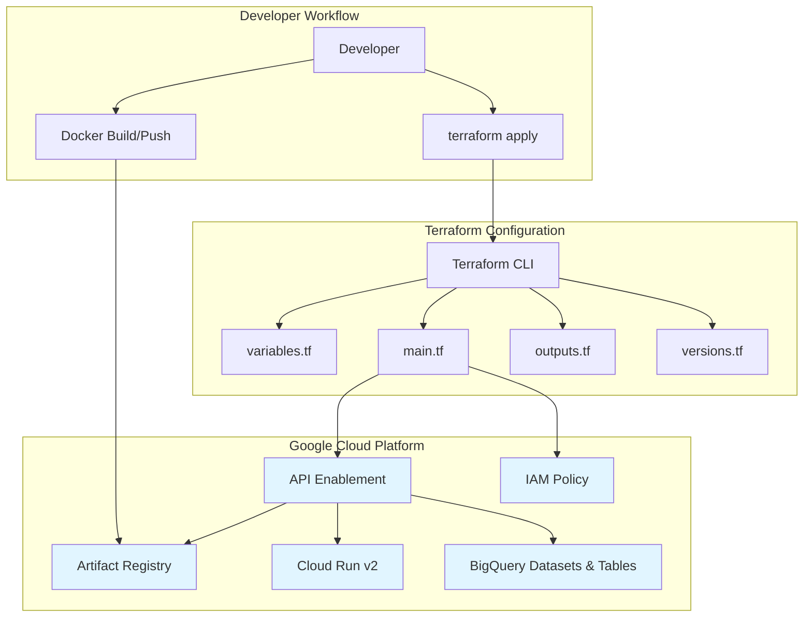
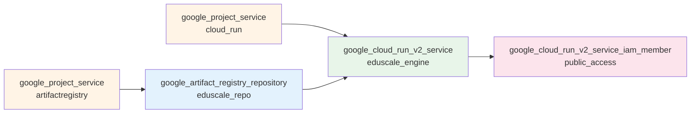
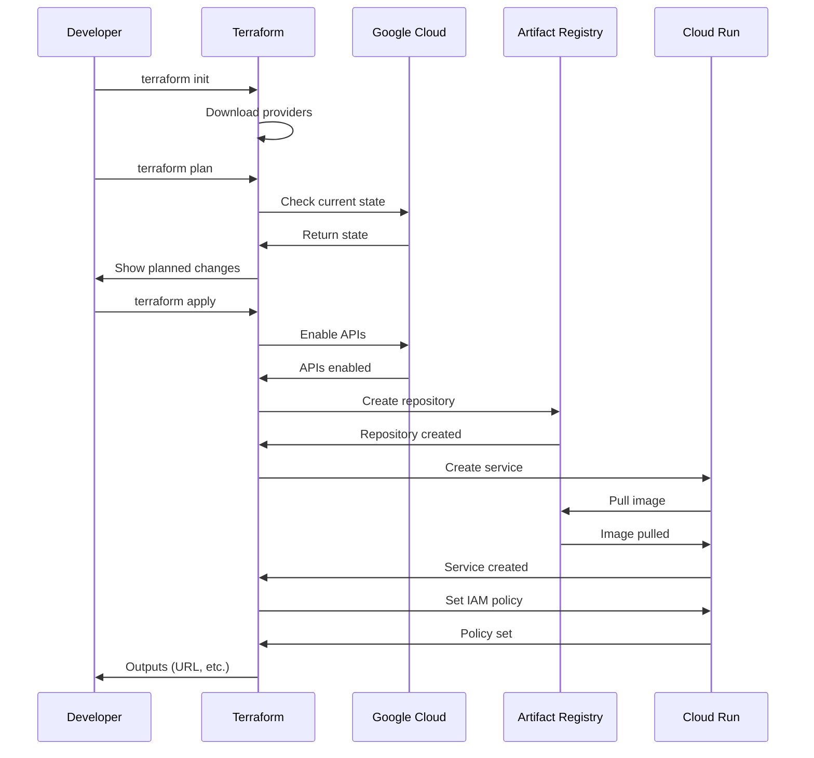
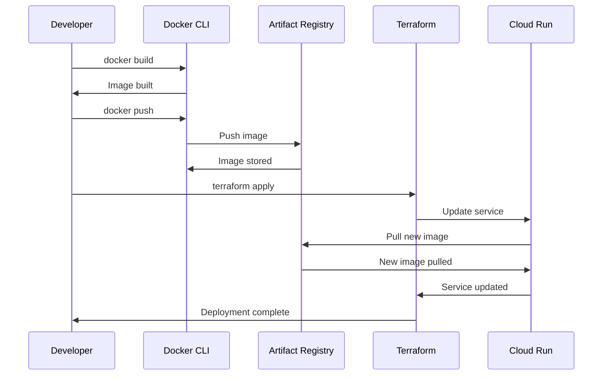

# Design Document: Terraform GCP Infrastructure

## Overview

This design document describes the Terraform infrastructure-as-code configuration for provisioning Google Cloud Platform resources for the EduScale Engine service. The configuration follows Terraform best practices with a modular file structure, comprehensive variable management, and clear separation of concerns. The design prioritizes simplicity, maintainability, and ease of use for developers while ensuring production-ready infrastructure.

The Terraform configuration provisions:
- **Artifact Registry**: A Docker repository for storing container images in an EU region
- **Cloud Run v2 Service**: A fully managed serverless platform for running the containerized FastAPI application
- **BigQuery Datasets**: Core and staging datasets for data warehouse operations
- **BigQuery Tables**: Dimension, fact, and tracking tables with proper partitioning and clustering
- **Service Accounts**: Dedicated service accounts for Cloud Run services (Engine, Tabular) with appropriate IAM permissions
- **Eventarc Triggers**: Event-driven triggers for MIME Decoder (uploads/*) and Tabular Service (text/*)
- **API Enablement**: Automatic activation of required Google Cloud APIs
- **IAM Policies**: Public access configuration and service-to-service permissions

## Architecture

### Infrastructure Components



### Resource Dependency Graph



### File Structure

```
infra/terraform/
├── versions.tf              # Terraform and provider version constraints
├── variables.tf             # Input variable definitions
├── main.tf                  # Core resource definitions (Artifact Registry, Cloud Run)
├── bigquery.tf              # BigQuery datasets and tables
├── outputs.tf               # Output value definitions
├── terraform.tfvars.example # Example variable values
└── README.md                # Documentation
```

## Components and Interfaces

### 1. Terraform Version Configuration (versions.tf)

**Responsibility**: Define Terraform and provider version constraints

**Key Elements**:
- Terraform version constraint: `>= 1.5, < 2.0`
- Google provider version: `~> 7.0`
- Provider configuration using variables
- Optional GCS backend configuration (commented)

**Design Decisions**:
- Use `~>` for provider version to allow patch updates but prevent breaking changes
- Separate versions.tf for clarity and easy version management
- Provider configuration uses variables for flexibility
- Local backend by default for simplicity
- GCS backend option documented but commented for team collaboration scenarios

**Interface**:
```hcl
terraform {
  required_version = ">= 1.5, < 2.0"
  required_providers {
    google = {
      source  = "hashicorp/google"
      version = "~> 7.0"
    }
  }
}

provider "google" {
  project = var.project_id
  region  = var.region
}
```

### 2. Variable Definitions (variables.tf)

**Responsibility**: Define all configurable parameters with types, defaults, and descriptions

**Variable Categories**:

**Core GCP Configuration**:
- `project_id` (required, no default)
- `region` (default: "europe-west1")

**Service Configuration**:
- `service_name` (default: "eduscale-engine")
- `repository_id` (default: "eduscale-engine-repo")
- `image_tag` (default: "latest")
- `service_version` (default: "0.1.0")
- `environment` (default: "prod")

**Cloud Run Configuration**:
- `min_instance_count` (default: 0)
- `max_instance_count` (default: 10)
- `cpu` (default: "1")
- `memory` (default: "512Mi")
- `container_port` (default: 8080)
- `allow_unauthenticated` (default: true)

**Design Decisions**:
- No default for `project_id` forces explicit configuration
- Sensible defaults for all other variables enable quick setup
- String type for CPU to support Cloud Run's format ("1", "2", "4")
- Boolean for `allow_unauthenticated` enables conditional IAM policy
- Comprehensive descriptions for self-documenting configuration

**Variable Validation**:
- Type constraints ensure correct data types
- Defaults align with EduScale Engine requirements
- Memory values use Cloud Run format (Mi, Gi)

### 3. Main Resource Configuration (main.tf)

**Responsibility**: Define all GCP resources and their relationships

#### 3.1 API Enablement Resources

**Resources**:
- `google_project_service.artifact_registry`
- `google_project_service.cloud_run`

**Configuration**:
```hcl
resource "google_project_service" "artifact_registry" {
  project = var.project_id
  service = "artifactregistry.googleapis.com"
  disable_on_destroy = false
}
```

**Design Decisions**:
- Enable APIs before creating dependent resources
- `disable_on_destroy = false` prevents accidental API disablement
- Separate resources for each API for granular control
- Idempotent: safe to apply multiple times

#### 3.2 Artifact Registry Repository

**Resource**: `google_artifact_registry_repository.eduscale_repo`

**Configuration**:
```hcl
resource "google_artifact_registry_repository" "eduscale_repo" {
  location      = var.region
  repository_id = var.repository_id
  description   = "Docker repository for EduScale Engine container images"
  format        = "DOCKER"
  
  depends_on = [google_project_service.artifact_registry]
}
```

**Design Decisions**:
- Format set to "DOCKER" for container images
- Location uses region variable for consistency
- Explicit dependency on API enablement
- No cleanup policies in initial version (can be added later)
- Repository ID from variable for flexibility

**Image Path Format**:
```
{region}-docker.pkg.dev/{project_id}/{repository_id}/{service_name}:{image_tag}
```

#### 3.3 Cloud Run v2 Service

**Resource**: `google_cloud_run_v2_service.eduscale_engine`

**Configuration Structure**:
```hcl
resource "google_cloud_run_v2_service" "eduscale_engine" {
  name     = var.service_name
  location = var.region
  ingress  = "INGRESS_TRAFFIC_ALL"
  
  template {
    scaling { ... }
    containers { ... }
  }
  
  depends_on = [
    google_project_service.cloud_run,
    google_artifact_registry_repository.eduscale_repo
  ]
}
```

**Scaling Configuration**:
- `min_instance_count`: Scale to zero for cost savings (default: 0)
- `max_instance_count`: Prevent runaway costs (default: 10)
- Cloud Run manages autoscaling based on traffic

**Container Configuration**:
- Image constructed from variables
- Port from `container_port` variable (8080)
- CPU and memory from variables
- Environment variables matching FastAPI app expectations

**Environment Variables**:
- `ENV`: Deployment environment
- `SERVICE_NAME`: Service identifier
- `SERVICE_VERSION`: Version string
- `GCP_PROJECT_ID`: GCP project
- `GCP_REGION`: Deployment region
- `GCP_RUN_SERVICE`: Service name

**Design Decisions**:
- Use Cloud Run v2 for latest features and better API
- `INGRESS_TRAFFIC_ALL` allows public internet access
- Explicit dependencies ensure correct creation order
- Environment variables match existing FastAPI configuration
- Resource limits prevent excessive costs

#### 3.4 IAM Policy for Public Access

**Resource**: `google_cloud_run_v2_service_iam_member.public_access`

**Configuration**:
```hcl
resource "google_cloud_run_v2_service_iam_member" "public_access" {
  count = var.allow_unauthenticated ? 1 : 0
  
  location = google_cloud_run_v2_service.eduscale_engine.location
  name     = google_cloud_run_v2_service.eduscale_engine.name
  role     = "roles/run.invoker"
  member   = "allUsers"
}
```

**Design Decisions**:
- Conditional creation using `count` meta-argument
- Grants `roles/run.invoker` to `allUsers` for public access
- References service attributes for consistency
- Can be disabled by setting `allow_unauthenticated = false`
- Enables health endpoint access without authentication

### 3.5 Tabular Service Account and IAM Permissions

**Purpose**: Provide Tabular Service with necessary permissions for data processing

**Service Account**:
```hcl
resource "google_service_account" "tabular_service" {
  account_id   = "tabular-service"
  display_name = "Tabular Service Account"
  description  = "Service account for Tabular Service running on Cloud Run"
}
```

**IAM Permissions**:

1. **Storage Object Viewer** - Read text files from GCS:
```hcl
resource "google_storage_bucket_iam_member" "tabular_storage_viewer" {
  bucket = google_storage_bucket.uploads.name
  role   = "roles/storage.objectViewer"
  member = "serviceAccount:${google_service_account.tabular_service.email}"
}
```

2. **BigQuery Data Editor** - Write to BigQuery tables:
```hcl
resource "google_project_iam_member" "tabular_bigquery_editor" {
  project = var.project_id
  role    = "roles/bigquery.dataEditor"
  member  = "serviceAccount:${google_service_account.tabular_service.email}"
}
```

3. **BigQuery Job User** - Execute BigQuery jobs:
```hcl
resource "google_project_iam_member" "tabular_bigquery_job_user" {
  project = var.project_id
  role    = "roles/bigquery.jobUser"
  member  = "serviceAccount:${google_service_account.tabular_service.email}"
}
```

**Design Decisions**:
- Dedicated service account follows principle of least privilege
- Storage permissions scoped to uploads bucket only
- BigQuery permissions at project level (required for cross-dataset operations)
- Service account created even if Tabular Service not yet deployed
- Permissions ready for when Tabular Service is deployed via GitHub Actions

### 3.6 Eventarc Trigger for Tabular Service

**Purpose**: Automatically invoke Tabular Service when text files are created

**Trigger Configuration**:
```hcl
resource "google_eventarc_trigger" "text_trigger" {
  count    = var.enable_eventarc ? 1 : 0
  name     = "text-files-trigger"
  location = var.region
  project  = var.project_id

  matching_criteria {
    attribute = "type"
    value     = "google.cloud.storage.object.v1.finalized"
  }

  matching_criteria {
    attribute = "bucket"
    value     = google_storage_bucket.uploads.name
  }

  matching_criteria {
    attribute = "name"
    value     = "text/"
    operator  = "match-path-pattern"
  }

  destination {
    cloud_run_service {
      service = data.google_cloud_run_service.tabular[0].name
      region  = data.google_cloud_run_service.tabular[0].location
    }
  }

  service_account = google_service_account.eventarc_trigger.email

  depends_on = [
    google_project_service.eventarc,
    google_cloud_run_service_iam_member.eventarc_tabular_invoker,
    google_storage_bucket.uploads
  ]
}
```

**IAM Permission for Eventarc → Tabular**:
```hcl
resource "google_cloud_run_service_iam_member" "eventarc_tabular_invoker" {
  count    = var.enable_eventarc ? 1 : 0
  service  = data.google_cloud_run_service.tabular[0].name
  location = data.google_cloud_run_service.tabular[0].location
  role     = "roles/run.invoker"
  member   = "serviceAccount:${google_service_account.eventarc_trigger.email}"
  project  = var.project_id
}
```

**Design Decisions**:
- Conditional creation based on `enable_eventarc` variable
- Filters events by `text/` prefix to match Transformer output
- Uses existing Eventarc service account (shared with MIME Decoder trigger)
- References Tabular service via data source (deployed separately via GitHub Actions)
- Automatic retry with exponential backoff on failures
- Separate trigger from MIME Decoder trigger for independent scaling

**Event Flow**:
1. Transformer saves text file to `gs://bucket/text/file_id.txt`
2. GCS emits OBJECT_FINALIZE event
3. Eventarc filters for `text/*` pattern
4. Eventarc invokes Tabular Service with CloudEvent
5. Tabular Service processes file and loads to BigQuery

### 4. Output Definitions (outputs.tf)

**Responsibility**: Export useful values after infrastructure creation

**Outputs**:

**Primary Outputs**:
- `cloud_run_url`: The public URL of the Cloud Run service
- `artifact_registry_repository`: The repository URL for Docker push
- `full_image_path`: Complete image path used by Cloud Run

**Confirmation Outputs**:
- `project_id`: Confirms the GCP project
- `region`: Confirms the deployment region
- `service_name`: Confirms the service name

**Design Decisions**:
- All outputs include descriptions
- Primary outputs provide actionable information
- Confirmation outputs help verify configuration
- URL output enables immediate testing
- Repository output used in CI/CD pipelines

**Usage Examples**:
```bash
# Get Cloud Run URL
terraform output -raw cloud_run_url

# Test health endpoint
curl $(terraform output -raw cloud_run_url)/health

# Get image path for docker push
terraform output -raw full_image_path
```

### 5. Example Variables File (terraform.tfvars.example)

**Responsibility**: Provide template for user configuration

**Content**:
- All variables with example values
- Comments explaining each variable
- Placeholder for `project_id`
- Defaults shown for reference

**Design Decisions**:
- Separate example file prevents accidental commits of real values
- Users copy to `terraform.tfvars` and customize
- `.gitignore` should exclude `terraform.tfvars`
- Shows all available configuration options
- Includes both required and optional variables

### 6. BigQuery Configuration (bigquery.tf)

**Responsibility**: Define BigQuery datasets and tables for data warehouse

#### 6.1 API Enablement

**Resource**: `google_project_service.bigquery`

**Configuration**:
```hcl
resource "google_project_service" "bigquery" {
  project = var.project_id
  service = "bigquery.googleapis.com"
  disable_on_destroy = false
}
```

**Design Decisions**:
- Enable BigQuery API before creating datasets
- Separate from other API enablement for clarity
- Idempotent and safe to apply multiple times

#### 6.2 BigQuery Datasets

**Resources**:
- `google_bigquery_dataset.core`: Main dataset for dimension and fact tables
- `google_bigquery_dataset.staging`: Temporary dataset for data loading

**Core Dataset Configuration**:
```hcl
resource "google_bigquery_dataset" "core" {
  dataset_id  = var.bigquery_dataset_id
  location    = var.region
  description = "Core dataset for EduScale data warehouse (dimensions and facts)"
  
  depends_on = [google_project_service.bigquery]
}
```

**Staging Dataset Configuration**:
```hcl
resource "google_bigquery_dataset" "staging" {
  dataset_id  = var.bigquery_staging_dataset_id
  location    = var.region
  description = "Staging dataset for temporary data loading operations"
  
  default_table_expiration_ms = var.bigquery_staging_table_expiration_days * 24 * 60 * 60 * 1000
  
  depends_on = [google_project_service.bigquery]
}
```

**Design Decisions**:
- Separate datasets for core and staging data
- Staging tables auto-expire after 7 days (configurable)
- Core tables have no expiration
- Location matches region variable for data locality
- Explicit dependencies on API enablement

#### 6.3 Dimension Tables

**Tables**: dim_region, dim_school, dim_time

**dim_region Schema**:
```hcl
resource "google_bigquery_table" "dim_region" {
  dataset_id = google_bigquery_dataset.core.dataset_id
  table_id   = "dim_region"
  
  schema = jsonencode([
    { name = "region_id", type = "STRING", mode = "REQUIRED" },
    { name = "region_name", type = "STRING", mode = "NULLABLE" },
    { name = "from_date", type = "DATE", mode = "NULLABLE" },
    { name = "to_date", type = "DATE", mode = "NULLABLE" }
  ])
}
```

**dim_school Schema**:
```hcl
resource "google_bigquery_table" "dim_school" {
  dataset_id = google_bigquery_dataset.core.dataset_id
  table_id   = "dim_school"
  
  schema = jsonencode([
    { name = "school_name", type = "STRING", mode = "REQUIRED" },
    { name = "region_id", type = "STRING", mode = "NULLABLE" },
    { name = "from_date", type = "DATE", mode = "NULLABLE" },
    { name = "to_date", type = "DATE", mode = "NULLABLE" }
  ])
}
```

**dim_time Schema**:
```hcl
resource "google_bigquery_table" "dim_time" {
  dataset_id = google_bigquery_dataset.core.dataset_id
  table_id   = "dim_time"
  
  schema = jsonencode([
    { name = "date", type = "DATE", mode = "REQUIRED" },
    { name = "year", type = "INTEGER", mode = "NULLABLE" },
    { name = "month", type = "INTEGER", mode = "NULLABLE" },
    { name = "day", type = "INTEGER", mode = "NULLABLE" },
    { name = "quarter", type = "INTEGER", mode = "NULLABLE" },
    { name = "day_of_week", type = "INTEGER", mode = "NULLABLE" }
  ])
}
```

**Design Decisions**:
- Dimension tables for slowly changing dimensions
- from_date and to_date support temporal tracking
- No partitioning on dimension tables (small size)
- Explicit schemas ensure consistency with Tabular service

#### 6.4 Fact Tables

**Tables**: fact_assessment, fact_intervention

**fact_assessment Schema**:
```hcl
resource "google_bigquery_table" "fact_assessment" {
  dataset_id = google_bigquery_dataset.core.dataset_id
  table_id   = "fact_assessment"
  
  time_partitioning {
    type  = "DAY"
    field = "date"
  }
  
  clustering = ["region_id"]
  
  schema = jsonencode([
    { name = "date", type = "DATE", mode = "REQUIRED" },
    { name = "region_id", type = "STRING", mode = "REQUIRED" },
    { name = "school_name", type = "STRING", mode = "NULLABLE" },
    { name = "student_id", type = "STRING", mode = "NULLABLE" },
    { name = "student_name", type = "STRING", mode = "NULLABLE" },
    { name = "subject", type = "STRING", mode = "NULLABLE" },
    { name = "test_score", type = "FLOAT", mode = "NULLABLE" },
    { name = "file_id", type = "STRING", mode = "REQUIRED" },
    { name = "ingest_timestamp", type = "TIMESTAMP", mode = "REQUIRED" }
  ])
}
```

**fact_intervention Schema**:
```hcl
resource "google_bigquery_table" "fact_intervention" {
  dataset_id = google_bigquery_dataset.core.dataset_id
  table_id   = "fact_intervention"
  
  time_partitioning {
    type  = "DAY"
    field = "date"
  }
  
  clustering = ["region_id"]
  
  schema = jsonencode([
    { name = "date", type = "DATE", mode = "REQUIRED" },
    { name = "region_id", type = "STRING", mode = "REQUIRED" },
    { name = "school_name", type = "STRING", mode = "NULLABLE" },
    { name = "intervention_type", type = "STRING", mode = "NULLABLE" },
    { name = "participants_count", type = "INTEGER", mode = "NULLABLE" },
    { name = "file_id", type = "STRING", mode = "REQUIRED" },
    { name = "ingest_timestamp", type = "TIMESTAMP", mode = "REQUIRED" }
  ])
}
```

**Design Decisions**:
- Partition by date for query performance and cost optimization
- Cluster by region_id for regional queries
- Include file_id and ingest_timestamp for audit trail
- Schemas match Tabular service normalized data models

#### 6.5 Observations Table

**Table**: observations (for unstructured/mixed data)

**observations Schema**:
```hcl
resource "google_bigquery_table" "observations" {
  dataset_id = google_bigquery_dataset.core.dataset_id
  table_id   = "observations"
  
  time_partitioning {
    type  = "DAY"
    field = "ingest_timestamp"
  }
  
  clustering = ["region_id"]
  
  schema = jsonencode([
    { name = "file_id", type = "STRING", mode = "REQUIRED" },
    { name = "region_id", type = "STRING", mode = "REQUIRED" },
    { name = "observation_text", type = "STRING", mode = "NULLABLE" },
    { name = "source_table_type", type = "STRING", mode = "NULLABLE" },
    { name = "ingest_timestamp", type = "TIMESTAMP", mode = "REQUIRED" }
  ])
}
```

**Design Decisions**:
- Stores free-form text and MIXED table type data
- Partition by ingest_timestamp for time-based queries
- Cluster by region_id for regional filtering
- Flexible schema for unstructured data

#### 6.6 Ingest Runs Tracking Table

**Table**: ingest_runs (for pipeline execution tracking)

**ingest_runs Schema**:
```hcl
resource "google_bigquery_table" "ingest_runs" {
  dataset_id = google_bigquery_dataset.core.dataset_id
  table_id   = "ingest_runs"
  
  time_partitioning {
    type  = "DAY"
    field = "created_at"
  }
  
  clustering = ["region_id", "status"]
  
  schema = jsonencode([
    { name = "file_id", type = "STRING", mode = "REQUIRED" },
    { name = "region_id", type = "STRING", mode = "REQUIRED" },
    { name = "status", type = "STRING", mode = "REQUIRED" },
    { name = "step", type = "STRING", mode = "NULLABLE" },
    { name = "error_message", type = "STRING", mode = "NULLABLE" },
    { name = "created_at", type = "TIMESTAMP", mode = "REQUIRED" },
    { name = "updated_at", type = "TIMESTAMP", mode = "REQUIRED" }
  ])
}
```

**Design Decisions**:
- Tracks all ingestion pipeline executions
- Partition by created_at for time-based queries
- Cluster by region_id and status for filtering
- Stores error messages for debugging
- Provides audit trail for all data loads

### 7. Documentation (README.md)

**Responsibility**: Comprehensive guide for using the Terraform configuration

**Sections**:

**Introduction**:
- Purpose and scope
- List of provisioned resources

**Prerequisites**:
- Terraform version requirement
- gcloud CLI setup
- GCP project requirement
- IAM permissions needed

**Quick Start**:
- Step-by-step instructions
- Variable configuration
- Terraform commands (init, plan, apply)
- Expected outputs

**Docker Image Management**:
- Build commands
- Authentication setup
- Push commands
- Image tagging strategy

**Configuration Reference**:
- Table of all variables
- Defaults and descriptions
- Usage examples

**Testing**:
- How to verify deployment
- Health endpoint testing
- Expected responses

**Updating Infrastructure**:
- Changing configuration
- Deploying new images
- Scaling adjustments

**Troubleshooting**:
- Common errors and solutions
- Permission issues
- API enablement delays
- Image not found errors

**Future Enhancements**:
- Planned additions (GCS, BigQuery, etc.)
- Extension points

**Design Decisions**:
- Comprehensive but scannable
- Code examples for all operations
- Troubleshooting based on common issues
- Links to relevant documentation
- Architecture diagram for visual understanding

## Data Flow

### Deployment Flow



### Image Update Flow



## Configuration Management

### Variable Precedence

Terraform loads variables in this order (later sources override earlier):

1. Default values in `variables.tf`
2. `terraform.tfvars` file
3. `*.auto.tfvars` files (alphabetical order)
4. `-var` command-line flags
5. Environment variables (`TF_VAR_name`)

**Recommended Approach**:
- Use `terraform.tfvars` for project-specific values
- Use `-var` flags for CI/CD overrides
- Keep defaults in `variables.tf` for common values

### State Management

**Local State (Default)**:
- State stored in `terraform.tfstate` file
- Simple for single-developer scenarios
- Should be backed up regularly
- Not suitable for team collaboration

**Remote State (Optional)**:
- State stored in GCS bucket
- Enables team collaboration
- Provides state locking
- Requires pre-created bucket
- Configuration commented in `versions.tf`

**State Security**:
- State files contain sensitive data
- Never commit state to version control
- Use encrypted remote backends for production
- Restrict access to state storage

## Error Handling

### API Enablement Delays

**Issue**: APIs may take time to propagate after enablement

**Mitigation**:
- Explicit `depends_on` relationships
- Retry `terraform apply` if initial attempt fails
- Document expected delay in README

### Image Not Found

**Issue**: Cloud Run service creation fails if image doesn't exist

**Mitigation**:
- Document image build/push as prerequisite
- Provide clear error message guidance
- README includes image management section
- Consider using a placeholder image for initial setup

### Permission Errors

**Issue**: Insufficient IAM permissions for resource creation

**Mitigation**:
- Document required roles in README
- Provide clear error messages
- Suggest using `roles/editor` for development
- List fine-grained roles for production

### Resource Conflicts

**Issue**: Resources already exist from manual creation

**Mitigation**:
- Use `terraform import` to adopt existing resources
- Document import commands in README
- Use unique resource names
- Check for conflicts before apply

## Security Considerations

### IAM and Access Control

**Public Access**:
- Controlled by `allow_unauthenticated` variable
- Can be disabled for internal services
- Default is `true` for health endpoint access
- Future: Add authentication for data endpoints

**Service Account**:
- Uses default Cloud Run service account
- Future: Create dedicated service account with minimal permissions
- Document service account best practices

### Secrets Management

**Current State**:
- No secrets required for initial setup
- Environment variables are non-sensitive

**Future Considerations**:
- Use Google Secret Manager for sensitive data
- Reference secrets in Cloud Run configuration
- Never store secrets in Terraform code or state
- Use separate secret management workflow

### Network Security

**Current State**:
- Public ingress for health endpoint
- HTTPS enforced by Cloud Run

**Future Enhancements**:
- VPC connector for private resources
- Cloud Armor for DDoS protection
- Load balancer with custom domain
- IP allowlisting for admin endpoints

## Performance Considerations

### Cold Start Optimization

**Configuration**:
- `min_instance_count = 0` for cost savings
- Small container image for fast pulls
- Minimal startup time in FastAPI app

**Trade-offs**:
- First request after idle has latency
- Can set `min_instance_count = 1` for always-warm instance
- Cost vs. performance decision

### Scaling Configuration

**Defaults**:
- Min: 0 instances (scale to zero)
- Max: 10 instances (cost protection)
- Cloud Run autoscales based on traffic

**Tuning**:
- Increase max for high traffic
- Set min > 0 for consistent performance
- Monitor Cloud Run metrics for optimization

### Resource Allocation

**Defaults**:
- CPU: 1 vCPU
- Memory: 512Mi

**Considerations**:
- FastAPI is lightweight, defaults sufficient
- Increase for ML model inference
- Monitor container metrics
- Cost increases with resources

## Testing Strategy

### Terraform Validation

**Commands**:
```bash
terraform fmt -check    # Check formatting
terraform validate      # Validate syntax
terraform plan          # Preview changes
```

**Integration**:
- Run in CI/CD pipeline
- Validate before merge
- Check for drift regularly

### Infrastructure Testing

**Manual Testing**:
1. Apply configuration
2. Verify resources created
3. Test health endpoint
4. Check logs in Cloud Logging
5. Verify scaling behavior

**Automated Testing** (Future):
- Terratest for infrastructure tests
- Validate outputs
- Test resource properties
- Cleanup after tests

### Deployment Verification

**Checklist**:
- [ ] Artifact Registry repository exists
- [ ] Cloud Run service is running
- [ ] Health endpoint returns 200
- [ ] Logs appear in Cloud Logging
- [ ] IAM policy allows public access
- [ ] Outputs contain correct values

## Deployment Workflow

### Initial Deployment

1. **Setup**:
   - Install Terraform >= 1.5
   - Authenticate with gcloud
   - Create GCP project

2. **Configuration**:
   - Copy `terraform.tfvars.example` to `terraform.tfvars`
   - Set `project_id`
   - Customize other variables if needed

3. **Build Image**:
   - Build Docker image
   - Authenticate Docker with Artifact Registry
   - Push image to registry

4. **Deploy Infrastructure**:
   - `terraform init`
   - `terraform plan`
   - `terraform apply`

5. **Verify**:
   - Get Cloud Run URL from outputs
   - Test health endpoint
   - Check Cloud Logging

### Update Deployment

**Configuration Changes**:
```bash
# Edit terraform.tfvars
terraform plan
terraform apply
```

**New Image Version**:
```bash
# Build and push new image
docker build -t {image_path}:v1.0.0 .
docker push {image_path}:v1.0.0

# Update Terraform
terraform apply -var="image_tag=v1.0.0"
```

**Rollback**:
```bash
# Deploy previous image tag
terraform apply -var="image_tag=previous-tag"
```

## Future Extensibility

### Planned Additions

**Phase 2 - Data Storage**:
- Cloud Storage buckets for file uploads
- BigQuery datasets for analytics
- Firestore for metadata

**Phase 3 - Advanced Features**:
- Cloud Functions for ML inference
- Pub/Sub for event processing
- Cloud Scheduler for batch jobs

**Phase 4 - Production Hardening**:
- Custom service accounts
- VPC networking
- Cloud Armor
- Cloud CDN
- Custom domains

### Extension Points

**Modular Structure**:
- Add new `.tf` files for new resources
- Use Terraform modules for reusable components
- Separate environments with workspaces

**Variable Expansion**:
- Add variables for new features
- Maintain backward compatibility
- Document new variables

**Output Expansion**:
- Export new resource attributes
- Provide connection strings
- Include resource IDs for other tools

## Technology Choices

### Terraform vs. Alternatives

**Why Terraform**:
- Declarative infrastructure-as-code
- Multi-cloud support (future flexibility)
- Large community and ecosystem
- State management
- Plan/preview before apply

**Alternatives Considered**:
- **gcloud CLI**: Imperative, harder to maintain
- **Cloud Deployment Manager**: GCP-specific, less popular
- **Pulumi**: Requires programming language knowledge
- **Manual Console**: Not reproducible, error-prone

### Cloud Run v2 vs. v1

**Why v2**:
- Modern API design
- Better feature support
- Future-proof
- Improved configuration structure

**Trade-offs**:
- Slightly different resource structure
- Requires newer provider version
- Well-documented migration path

### Local vs. Remote State

**Default: Local**:
- Simple for hackathon/development
- No additional setup required
- Easy to understand

**Optional: Remote (GCS)**:
- Team collaboration
- State locking
- Backup and versioning
- Documented for future use

## Success Criteria

The Terraform configuration is successful if:

1. ✅ Developer can deploy infrastructure with 3 commands (init, plan, apply)
2. ✅ All required GCP resources are created automatically
3. ✅ Configuration is customizable via variables
4. ✅ Outputs provide actionable information
5. ✅ Documentation is clear and comprehensive
6. ✅ Code follows Terraform best practices
7. ✅ Resources are properly dependent and ordered
8. ✅ Public access works for health endpoint
9. ✅ Configuration is maintainable and extensible
10. ✅ No hardcoded values or secrets in code
